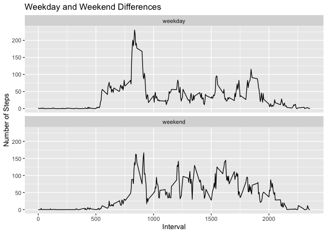

## Loading and preprocessing the data


```r
unzip('activity.zip')
activity <- read.csv(file = "activity.csv")
```


## What is mean total number of steps taken per day?

* Make a histogram of the total number of steps taken per day


```r
activity$date <- ymd(activity$date) # Convert date to date type
act1 <- activity %>% group_by(date) %>% summarise(steps = sum(steps))
```

```
## `summarise()` ungrouping output (override with `.groups` argument)
```

```r
act2 <- act1[!is.na(act1$steps),] # Remove days with NA

ggplot(data = act2, aes(steps))+geom_histogram(bins = 30)+labs(title = 'Histogram of Number of Steps per Day', x='Steps', y='Count')
```

<!-- -->

```r
# Calculate mean and median steps per day
mean_step = mean(act1$steps, na.rm = T, digits = 2)
median_step = median(act1$steps, na.rm = T)
mean_step
```

```
## [1] 10766.19
```

```r
median_step
```

```
## [1] 10765
```

* The mean of total number of steps taken per day is 10766.19
* The median of total number of steps taken per day is ``10765``

## What is the average daily activity pattern?

1. Time series plot of the 5-minute interval (x-axis) and the average number of steps taken, averaged across all days (y-axis)


```r
pattern <- activity %>% mutate(date = ymd(date)) %>% group_by(interval) %>% summarise(msteps = mean(steps, na.rm = T))
```

```
## `summarise()` ungrouping output (override with `.groups` argument)
```

```r
ggplot(data = pattern, aes(interval,msteps))+geom_line()+labs(title = 'Average Number of Steps in Five-Minute Intervals', x='Interval', y='Steps')
```

<!-- -->

```r
max_int <- pattern[pattern$msteps==max(pattern$msteps),1] 
```

2. The 5-minute interval, on average across all the days in the dataset, contains the maximum number of steps: ``835``


## Imputing missing values


```r
missing <- sum(is.na(activity$steps))
activity1 <- left_join(activity, pattern, by = 'interval')

for (i in 1:nrow(activity1)) {
        if (is.na(activity1$steps[i])) activity1$steps[i] = activity1$msteps[i]
        
}
nact <- activity1 %>% group_by(date) %>% summarise(steps = sum(steps))
```

```
## `summarise()` ungrouping output (override with `.groups` argument)
```

```r
ggplot(data = nact, aes(steps))+geom_histogram(bins = 30)+labs(title = 'Histogram of Steps per Day for Complete Data Set', x='Steps', y='Counts')
```

<!-- -->

1. The total number of missing values in the data set is ``2304``
2. The missing values are filled with the step averages in the intervals.
3. A newly created data set **activity1** is equal to the original dataset but with the missing data filled in.

## Are there differences in activity patterns between weekdays and weekends?

1. Create a new factor variable, **day**, in the dataset with two levels – “weekday” and “weekend” indicating whether a given date is a weekday or weekend day.
2. Make a panel plot


```r
#Create a factor variable indicating weekday or weekend
activity1 <- activity1 %>% mutate(day = wday(date))
for (i in 1:nrow(activity1)) {
        if (activity1$day[i] %in% 2:6) activity1$day[i] = 'weekday'
        else activity1$day[i] = 'weekend'
}
activity1$day <- as.factor(activity1$day)
# Weekday vs weekend pattern
patternw <- activity1 %>% group_by(interval,day) %>% summarise(mstepw = mean(steps))
```

```
## `summarise()` regrouping output by 'interval' (override with `.groups` argument)
```

```r
#Plot
ggplot(patternw)+geom_line(aes(interval, mstepw))+facet_wrap(~day, nrow = 2)+labs(title = 'Weekday and Weekend Differences' ,x='Interval', y='Number of Steps')
```

<!-- -->
